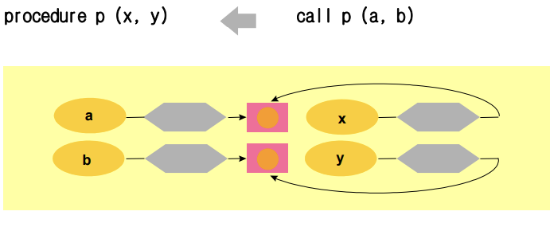
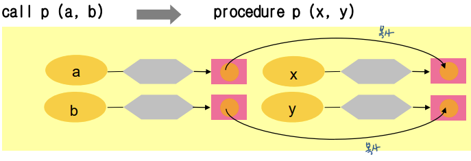

# 10. 부프로그램

## 10.1 개요

부프로그램(subprogram: function, procedure)

## 10.2 매개변수와 평가와 전달기법

실 매개 변수: 호출 프로그램으로 전달하기 위하여 사용된 식 또는 이름

형식 매개 변수: 부프로그램이 실행될 때, 실 매개 변수를 대신하여 사용되는 이름. 부프로그램 내부의 지역변수 역할을 함.

참조 호출(call by reference): 실 매개 변수 주소를 대응되는 형식 매개 변수에 보냄

값 호출(call by value): 실매개변수 값을 대응되는 지역변수로 복사. 실 매개 변수값 불변

결과 호출(call by result): callee가 반환 직전에 형식 매개변수의 값을 대응되는 실 매개 변수에 복사 후 반환.

값-결과 호출(call by value-result): callee 실생 시작 할 때 값 호출 기법, callee 실행 끝 날대 결과 호출 기법 사용. return value.

이름 호출 (call by name): 형식 매개 변수의 이름이 사용될 때마다 그에 대응되는 실 매개 변수 자체가 사용된 것으로 간주 (필요한 r-value와 l-value를 매번 계산)

## 10.3 형식 매개 변수 명세

