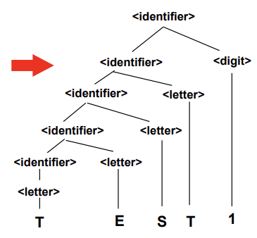
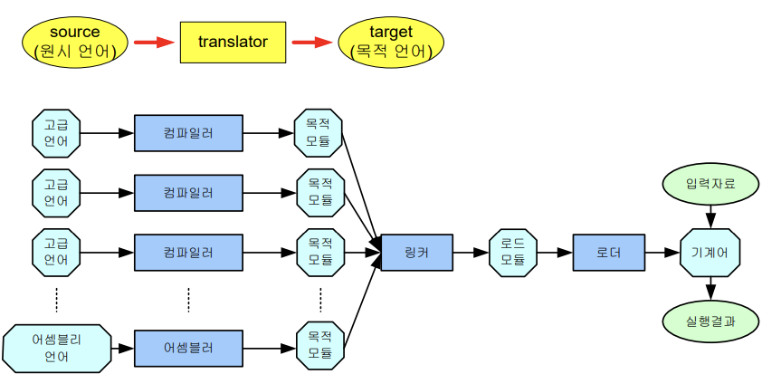

## ch4 프로그래밍 언어의 구문과 구현 기법


- 언어 정의: 구문(syntax) + 의미(semantics)
- 컴퓨터: 프로그래밍을 저장하고 실행할 수 있는 알고리즘과 자료 구조들의 집합
- 하드웨어 컴퓨터 (physicl computer) + 소프트웨어 시뮬레이터 컴퓨터 (software simulated computer) + 가상컴퓨터(virtual computer)


# 4.1 언어 구문

## 프로그래밍 언어의 어휘 구조

문자 집합: 영어 알파벳, 숫자, 특수문자

- 문자 코드 체계 표준: ASCII, 유니 코드 ...
- 정합 순서: 언어에 제공된 문자 순서

어휘 구조: 번역기는 어휘 분석 (lexical analysis, scanning) 단계에서 입력 프로그램의 일련의 문자들을 토큰으로 구분하고, 구문 분석(syntax analysis) 단계에서 이를 처리하여 구조를 결정한다.

- 언어 구성자: 한 개 이상의 어휘 토큰을 가지고 구문적으로 허용된 프로그램의 일부 구조
  - 식별자, 미리 정의된 식별자, 예약어
  - 구분자(delimeter), 분리자(seperator)


## 문맥 자유 문법과 BNF

**BNF**(Backus-Naur Form): 구문 형식을 정의하는 가장 보편적인 기법

- 한 언어에 대한 BNF 정의: 생성 규칙(production rule)들의 집합

- BNF 표기법에 의한 식별자 정의

  ```'
  <identifire> ::= <letter> | <identifire><letter> | <identifire><digit>
  <letter> ::= A | B | C | ... | X | Y | Z
  <digit> ::= 0 | 1 | 2 | ... | 8 | 9
  ```

- 메타 기호 (meta-symbol)

  - `::=` 정의하다

  - `<>` 비단말(nonterminal): BNF 규율로 다시 정의될 대상
    - `<>`로 묶이지 않은 기호는 단말(terminal) 기호: 알파벳, 예약어

  - `|` 택일기호

**EBNF**(Extended Backus-Naur Form): BNF의 확장형

- 추가된 메타 기호

  - `{a}` a가 0번 이상 반복
  - `[ ]` 0 또는 1번 선택
  - 메타 기호를 terminal로 사용하는 경우에는 작은 따옴표로 묶어서 사용

- subpascal 시작부에 대한 EBNF 표기

  ```
  <subpascal> :=program<ident> ; <block> .
  <block> ::=[<const_dcl>][<var_dcl>][<proc_dcl>] <compound-st>
  <const_dcl> ::=const <ident> = <number> {;<ident>=number};
  <var_dcl> ::=var <ident_list> : <type>{;<ident_list> : <type};
  <ident_list> ::=<ident> {, <ident>}
  <proc_dcl> ::=procedure <ident>['('<formal_param>')'];<block>;
  <compound-st>:==begin<statement>{;<statement>} end
  ```


## 구문 도표 (syntax diagram)

단말: 원, 비단말(다시 정의될 대상): 사각형

`|` 길 나눠짐

`[a]` 동그랗게 둘러쌈, `{a}` 네모낳게 둘러쌈


## 파스 트리와 추상 구문 트리 (AST)

```
<identifire> ::= <letter> | <identifire><letter> | <identifire><digit>
<letter> ::= A | B | C | ... | X | Y | Z
<digit> ::= 0 | 1 | 2 | ... | 8 | 9
```




## 모호성, 결합성 및 우선 순위

모호(ambigous): 같은 스트링 생성시 같은 문법 적용에 대하여 두 가지 서로 다른 파스 트리가 발생

- 연산자 우선순위가 모호한 경우: `-`와 `*`와 괄호의 우선순위가 명시되어 있지 않음

  ```
  <exp> ::=<exp>-<exp>|<exp>*<exp>|'('<exp>')'|<number>
  <number> ::=<number><digit>|<digit>
  <digit> ::= 0 | 1 | 2 | ... | 8 | 9
  ```

새 비단말기호 `<term>`와 문법 규칙을 추가하여 우선순위를 정함

```
<exp> ::=<exp>-<term>|<term>
<term> ::=<term>*<factor>|<factor>
<factor> ::='('<exp>')'|<number>
<number> ::= <number><digit>|<digit>
<digit> ::= 0 | 1 | 2 | ... | 8 | 9
```


## 구문과 프로그램 신뢰성

언어가 제대로 정의되지 않아 잘못된 해석을 할 수 있다; 재정의 필요

주석의 도움으로 더 정확히 이해 가능


# 4.2 프로그래밍 언어 구현 기법

고급언어를 실행시키는 구현 방법: 번역 기법(translation), 인터프리터 기법(interpretation)

## 번역 기법 (translation)



번역기의 종류

- 컴파일러(compiler): 고급 언어 -> 저급 언어(목적 코드나 어셈블리언어); 재배치 일어남

- 어셈블러(assembler): 어셈블리 언어 -> 기계어 명령어; 1대1 번역

- 링커(= 링키지 에디터): 기계어로 된 여러 개의 프로그램(각각 컴파일된 목적 코드들과 라이브러리들) -> 로드 모듈

- 로더(loader): 로드 모듈(기계어 프로그램) -> 실제 실행 가능한 기계어; 주기억 장치에 저장

- 프리프로세서: 고급 언어 -> 다른 고급 언어

  

## 인터프리터 기법 (interpretation)

고급 언어 기계를 다른 기계에서 소프트웨어로 시뮬레이션하는 방법; 특정 고급 언어를 기계어로 취급하는 가상 컴퓨터로 주어진 컴퓨터에서 시뮬레이션하여 실행시킴

**(고급 언어로 작성된 원시 프로그램) + (입력자료) ----[인터프리터]----> (실행결과)**


## 인터프리터 기법과 번역 기법

인터프리터 언어:  고급 언어를 적당한 중간 코드까지만 번역해서 곧바로 실행시킴

번역 기법

- 장점: 실행 시간 효율성 (한번 디코딩으로 반복 실행)
- 단점: 번역된 프로그럄이 큰 기억 장치 요구

인터프리터 기법

- 장점: 번역된 프로그램 크기 작음, 사용자 적응성 제공
- 단점: 실행 시간 오래걸림

하이브리드 기법: 프로그램을 실행시키기 쉬운 형태로 번역한 후, 그 번역된 형태의 프로그램을 디코드하여 시뮬레이션으로 실행

- 대부분의 인터프리터 언어가 이 방식
- 중간 언어를 저급 언어 수준으로 하여 효율성을 높이려고 하고 있다.


