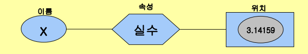
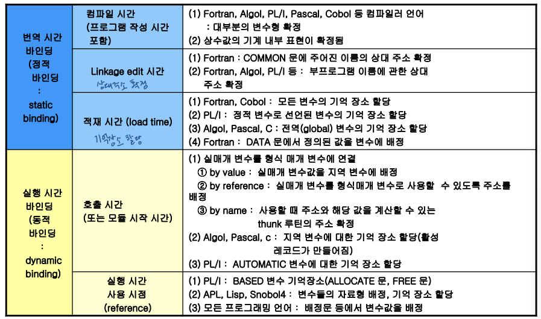

## *ch6. 변수, 바인딩, 식 및 제어문*

# 변수 (variables)

변수를 이루는 것: 이름, 속성(attribute)의 집합, 참조(reference, 주소), 값(value)

# 바인딩 (binding)

이름에 어떤 속성을 연결하는 과정

바인딩 시간 단계: 언어 정의시간 -> 언어 구현시간 -> 번역시간 -> 실행시간

바인딩 시간의 종류

- **실행시간:** 프로그램 실행 시간에 발생되는 바인딩 -> **동적 바인딩(dynamic binding)**
  - 변수에 값 배정, 변수에 기억 장소 할당
- **번역시간:** 언어를 번역하는 시점에서 발생되는 바인딩 -> **정적 바인딩(static binding)**
  - 번역시간 = 컴파일 시간 + 링크 시간 + 로드 시간
  - 변수의 형, 자료 구조의 형과 크기, 레코드 항목들의 형을 확정
- **언어의 구현 시간:** 언어 정의 시 일부 특성을 한정하지 않고, 언어를 컴퓨터에서 구현할 때 특성의 일부를 확정하는 바인딩
  - 정수의 자릿수, 실수의 유효숫자 개수, 수의 기계 내에서의 표기법 (IEEE 754)
- **언어 정의 시간:** 언어를 정의할 때 확정되는 바인딩
  - 혼합형 연산에서 두 피연산자의 형 결정

주요 언어에서 식별자의 바인딩 시간

# 선언 (Declarations)

선언문: 실행시 사용될 자료의 속성을 언어의 번역기에게 알려주는 프로그램 문장 (디폴트(default, 묵시적) 선언 포함)

선언문의 목적

- 주기억 장치 사용과 접근 방법의 효율성: 변수, 배열, 레코드 등의 효율적인 접근 가능
- 주기억 장치 경영의 효율성: 생성과 소멸 시점을 알므로 스택 기반 기억 장소 할당 등을 수행 가능
- 정적 형 검사(static type checking) 가능
  - 형고정 연산(type specific operation): 하드웨어 제공
  - 혼합형 연산(mized operation): 프로그래밍 언어 제공
  - 정적형 검사로 혼합형 연산을 형 고정 연산으로 변환 -> 효율성 추구
  - 혼합형 연산의 동적 형 검사 -> 유연성 추구

**정적 형 검사 (static type checking):** 컴파일러가 있는 언어가 함

- 모든 변수의 형 선언 요구
- 단점: 자료 생성, 소멸, 내용 변경에 많은 제약 존재
- 장점: 실행 시간 효율이 높음
- 정적 형 검사 언어: Java, C, Fortran, Algoal, Pascal 등 컴파일러 언어

**동적 형 검사 (dynamic type checking):** 인터프리터 언어가 함

- 선언문 사용 안함
- 장점: 프로그래밍 단순화, 유연성(flexibility) 높음
- 단점: 프로그램 실행 시간 지연, 자료 표현상의 효율 저하, 복잡한 기억 장소 경영 기법 요구
- 동적 형 검사 언어: Lisp, APL, Snobol 4 등 인터프리터 언어

Algol, Java, Ada: 약간의 효율성을 상실하여 실질적인 큰 유연성을 얻는 선언문 채택 - 실행시간에 기억 장소 확보

# 배정문 (Assignment statement)

배정문: 변수 내용을 변경시키는 기본 연산

l-value와 r-value

- l-value: 값이 저장되는 위치(주소, 참조)
- r-value: 저장되는 값

단순 배정문: 일반적인 구문

- <목적지 변수> <배정 연산자> <식>
- 배정연산자 `=`  사용: Fortran, Basic, PL/1, C, C++, Java
- 배정연산자 `:=` 사용: Algol 60, Pascal

다중 목적지 배정문: 값을 하나 이상의 목적지 변수에 배정을 허용

- 예: SUM과 TOTAL 모두에 0을 배정
  - PL/1: `SUM, TOTAL = 0`
  - C, C++, Java: `SUM = TOTAL = 0`

조건 목적지 배정문

- C++, Java: `flag ? count1 : count2 = 0`

복합 배정 연산자 (compound assignment operator): 배정문에 필요한 형태를 축약하여 표현

- C: `sum += value;`

단한 배정 연산자: 

- 전위 연산자 (prefix operator): `sum = ++count;`
- 후위 연산자 (postfix operator) `sum = count++;`
- 우선순위: 오른쪽에서 왼쪽 -  `-count++;`은 `-(count++);`과 같음

식으로서의 배정문

- C, C++, Java: 배정문 자체가 식 또는 피 연산자로 사용 가능
  - `while((ch = getchar()) != EOF) { ... }`
  - C, Java는 배정 연산자의 우선순위가 관계연산자의 우선순위보다 낮음 -> 배정문이 괄호 안에 표현되어야 함

혼합형 배정문: 배정문의 양편 자료형이 서로 다를 때