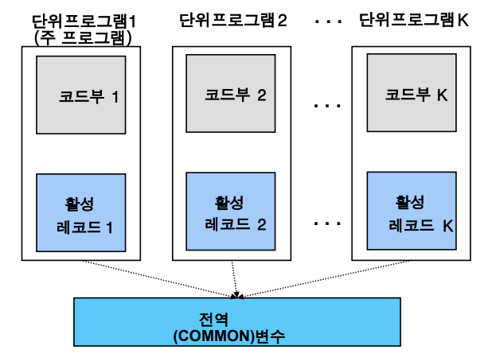
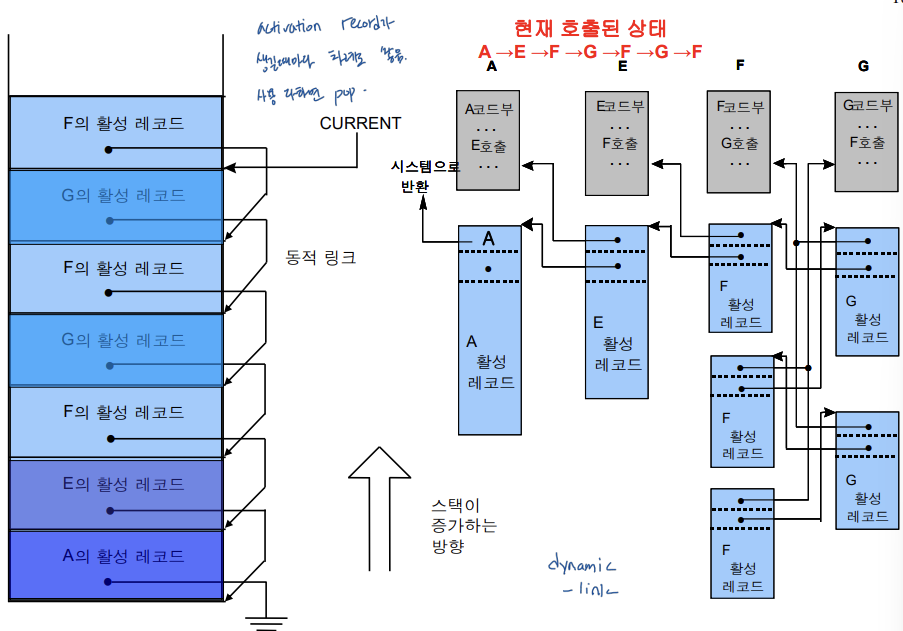
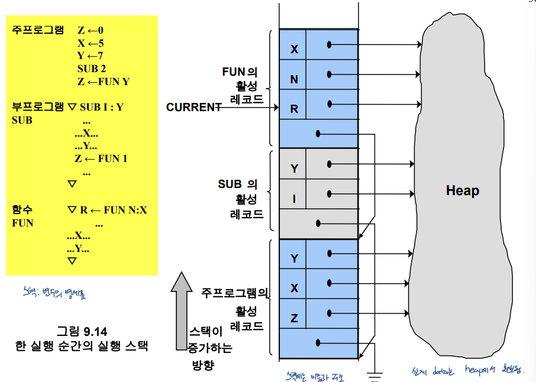

# *9. 기억 장소 배당*

## 9.1 정적 및 동적 기억 장소 배당

정적 기억 장소 할당: 번역 시간 할당 (적재 시간), 기억장소 크기와 위치가 정적으로 고정

동적 기억 장소 할당: 실행 시간 할당, 변수 제한 완화(자료형 크기 등), 인터프리터 언어

정적, 동적 기억 장소 할당 함꼐 수행: ALGOL, PL/1, C, C++

## 9.2 단위 프로그램

단위 활성화: 실행 시간에 한 단위 프로그램이 표현된 상태, 코드부 + 활성레코드

오프셋: 활성레코드에서 상대위치

참조 환경: 단위프로그램의 지역변수, 사용가능한 비지역변수

활성 레코드 바인딩: 코드부와 활성 레코드의 바인딩

- 재귀 호출: 활성레코드 재귀적으로 발생 -> 동적 바인딩

## 9.3 정적 기억 장소 배당

대표 언어 Fortran 77

장점: 구현용이, 간결함, 효율적인 프로그램 실행

단점: 유연성 적음 - 배열 크기 불변, recursion 불가

## 9.4 스택 기반 기억 장소 배당

동적 기억 장소 할당 기법: 스택 할당, 힙 할당

스택 할당(for automatic allocation): 시스템이 자동으로 정해주는 할당

- 스택이 증가하는 방향: 아래 -> 위

준동적 변수(semidynamic variable)

- 기억장소 크기: 활성화 시점 바인딩(동적)
- 기억장소 할당: 동적 할당 (스택 할당)

스택 변수: 준정적/준동적 변수, 힙 변수: 동적 변수

비지역 변수의 참조 방법

- 정적 체인: 단위프로그램의 정적 내포관계
- 디스플레이:  유효주소 (d, o) = DISPLAY(m-d) + o, d:간격, o:오프셋

## 9.5 힙 기억 장소 배당

힙 할당(for dynamic alloc): 사용자 마음대로 쓸 수 있는 공간

